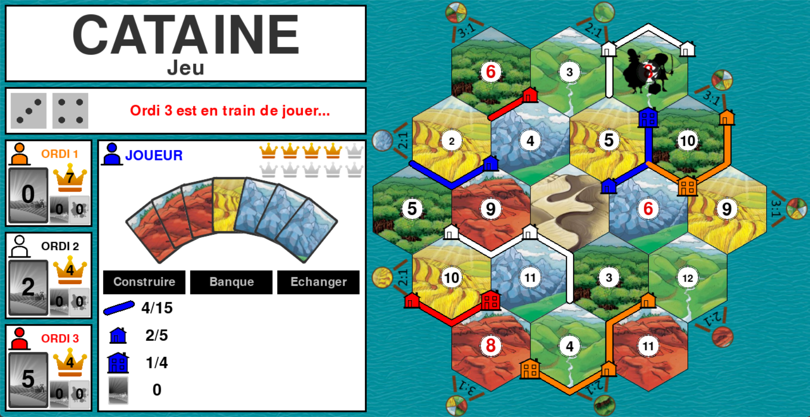

# Cataine

## Purpose

Create a bot to play to Catan.

Fell free to create your own strategy !

## Install and requirements

Clone from GitHub

Tested on python 3.10

Create en virtual environment :
`python -m venv venv310`

Activate this environment :
* Windows : `venv310\Scripts\activate.bat`
* Linux : `. venv310/bin/acivate`

Install the necessary packages : `python -m pip install -r requirements.txt`

Execute the programme : `python main.py`

